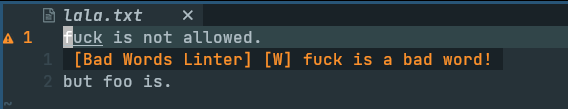

# Bad Words Linter

[](https://gitmoji.dev)
[](https://opensource.org/licenses/MIT)




## Usage

Whit [coc.nvim](https://github.com/neoclide/coc.nvim):

```json
"languageserver": {
  "bad-words-linter": {
    "command": "bad-words-linter",
    "args": ["--stdio"],
    "filetypes": ["text"]
  }
}
```

### License

This project is licensed under the [MIT License](./LICENSE.md).
